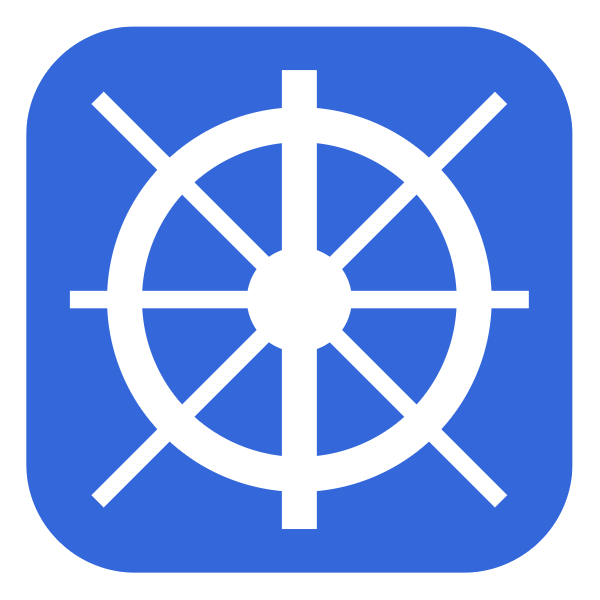

# 


Ahoy! And welcome to the exciting world of Kubernetes. I'm your Deckhand.

I'll help you deploy a Kubernetes cluster with no code. Fully automated. Open source.

- **Simple to use:** Visual drag and drop interface lets you virtually craft your system design, so you can focus on what matters and automate the rest.

- **Connect any software:** Instantly search for and connect any commercial or open source software, including your private Github repositories, and deploy it with a click.

- **No vendor lock-in:** We'll deploy directly to your linked cloud provider, so you can involve Deckhand as much or as little as you'd like, and take back the wheel at any time.

## Features



Behind the scenes, Deckhad abstracts away all the work of setting up a Kubernetes cluster, including:

- Setting up VPCs, subnets, route tables, security groups, and gateways
- Provisioning an EKS cluster and installing all the necessary add-ons
- Spinning up EC2 instances as nodes in the cluster
- Implementing an EFS for volume storage
- Dockerizing Github repos and pushing to ECR
- Pulling down Docker Hub images
- Scanning images for necessary environmental variables and exposed ports, guiding the user to add them to their configurations
- Generating YAML files for deployments, services, configmaps, secrets, persistent volume claims, and ingresses
- Applying all the YAML files to your cluster
- Obtaining a public url for your app
- Automating the entire teardown process with a single click

## Getting Started

### Run Locally

#### Software requirements

- Docker (must be running in background)
- AWS CLI
- kubectl
- Terraform

#### Clone repository and run

```bash
npm install
npm run tf-init
```

### Use our Web App

Coming soon!

## Link Third-Party Accounts

###  GitHub

GitHub is required to search, build, and deploy your Git repositories into Kubernetes pods. It is also how you log into Deckhand.

If you haven't already, first create GitHub account. Then, from the Deckhand login page, click "Log in with GitHub". This will redirect you to GitHub to authorize Deckhand to access your account and repositories. Click "Authoize Deckhand". This will redirect you back to the Deckhand app and log in.

###  Amazon Web Services (AWS)

We deploy directly to your AWS account. The specific services automated include AWS VPC, EKS, EC2, ECR and EFS.

If you haven't already, first create an AWS account. Then:

#### Create Deckhand IAM user

1. Login to AWS account as a root
2. Navigate to IAM -> Users -> Create User
3. Enter user name as "deckhand"
4. Check "Provide user access to the AWS Management Console"
5. Select "I want to create an IAM user"
6. Click "Next"
7. Select "Attach policies directly"
8. Search and check the "AdministratorAccess" policy
9. Click "Create User"
10. Save a record of your console sign-in URL, username, and password

#### Get credentials for Deckhand IAM user

1. Visit console sign-in URL, login as IAM user, and change password on login
2. Navigate IAM -> Users -> deckhand -> "Security credentials" tab
3. "Access keys" section -> Create access key
4. Select Command Line Interface (CLI)
5. Check "I understand the above recommendation…"
6. Click "Next"
7. Click "Create access key"
8. Save a record of your "Access key" and "Secret access key"
9. Enter these credentials in Deckhand when prompted to link your AWS account

## Troubleshooting

### Building Pods

If running locally, make sure the dependencies listed above are installed. Make sure Docker is running locally. Building repos and scanning ports uses the local Docker Daemon to execute docker commands.

Make sure Github repositories contain a Dockerfile. This is used to build the Docker image as well as scan the Dockerfile for the exposed port.

### Deploying Pods

An inability to deploy is typically an indication that there are not enough resources in your cluster to support the pods you are trying to run.

To troubleshoot, make sure you have enough resources in your cluster. Adjust the following in your cluster configuration and try deploying again:

- Increase the number of nodes
- Select instance type with higher capacity

## Future Development

Upcoming features include:

- Google Cloud Platform support
- Microsoft Azure support
- Advanced cluster monitoring

As an open source product, we welcome your contributions! See the [Contributing](contributing.md) page for details.

## Star us on GitHub!

⭐ Anchor your support with a star! Your star not only supports our work but also boosts our visibility and community engagement. It's a simple gesture that propels our open source mission forward.
